## Product and category dimension (snowflakes)

### Execute sql queries

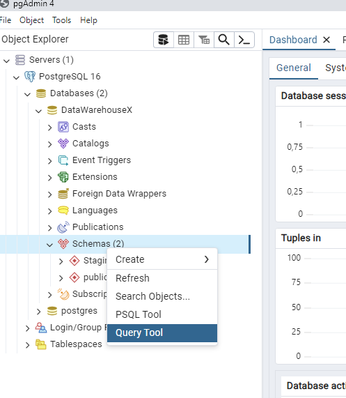

We use the SQL in the file `Ressources/Raw-Data/01-dimensional-modeling/SQL+Script_DM_Example.txt`

We execute the queries step by step.

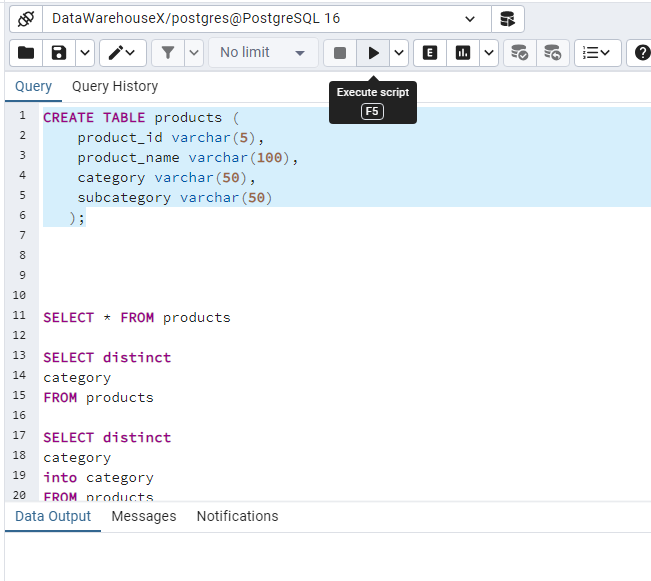

### Import csv

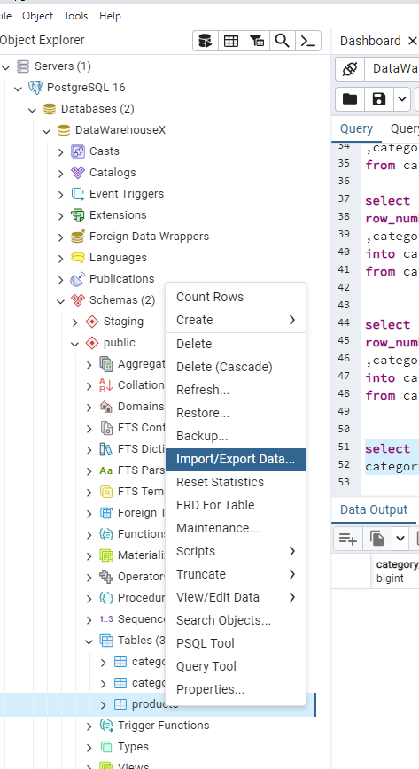

We import csv from  `Ressources/Raw-Data/01-dimensional-modeling/products.csv`

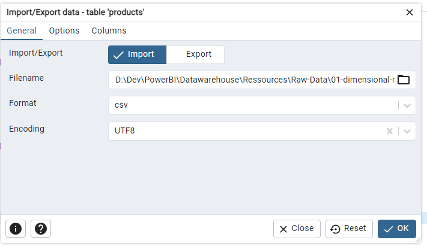

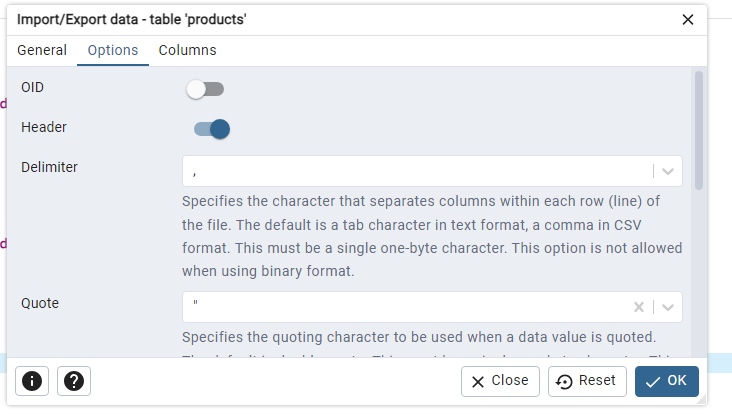

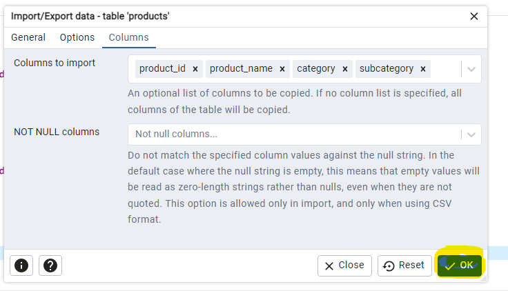

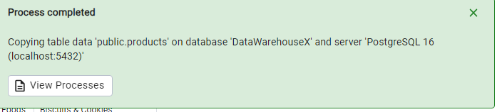

In case of problem check if the binary path (on Windows) for Postres.

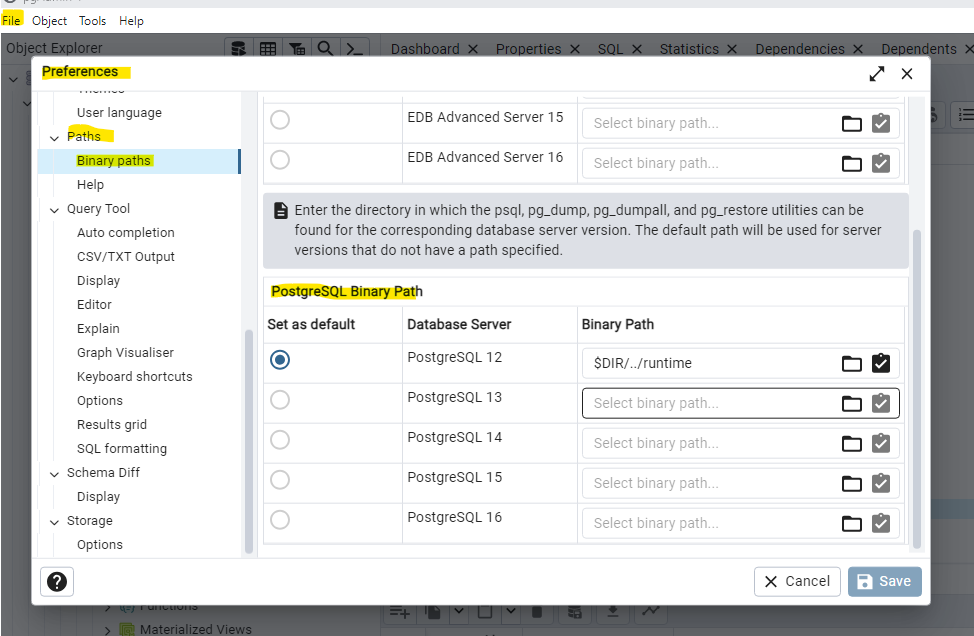

The query `SELECT * FROM products  ` should return:

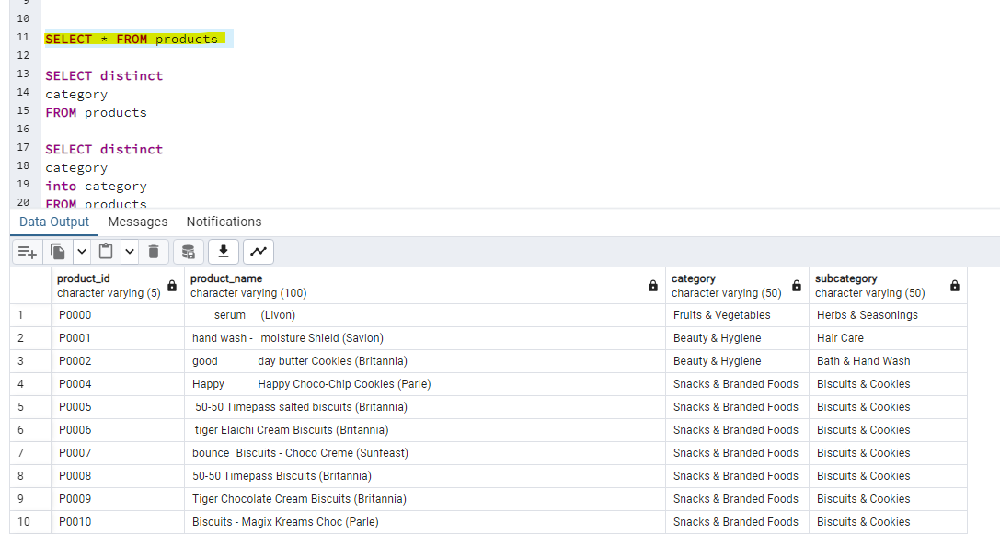

### Create separate table for Category

```sql
SELECT distinct
category
INTO category
FROM products
```

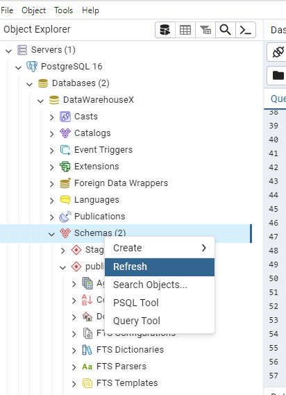

Then:

```sql
SELECT 
category 
,ROW_NUMBER() OVER (ORDER BY category)
FROM category
```

Should return:

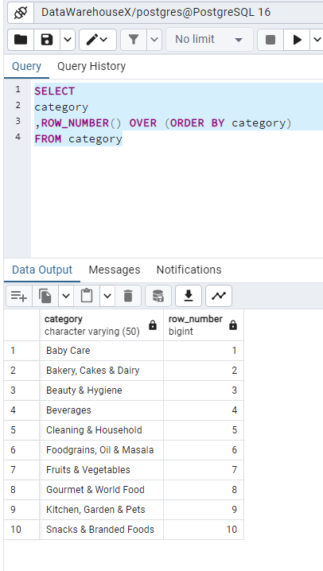

Then:

```sql
SELECT 
row_number() over (ORDER BY category) AS category_id
,category 
INTO category_table
FROM category
```


```sql
SELECT * FROM
category_table
```

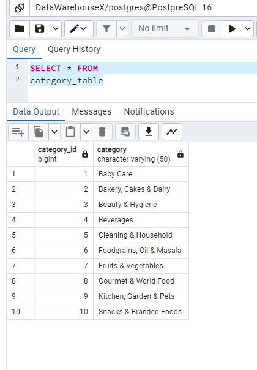

```sql
SELECT * FROM products
```

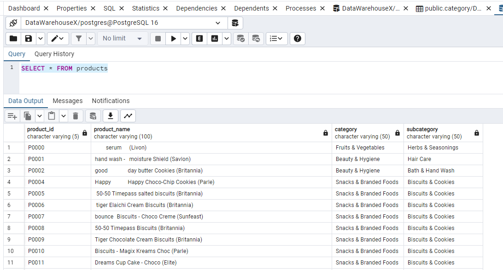