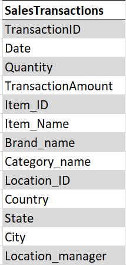

# **Facts & Dimensions (SalesTransactions)**

**Project description:**

You are assigned to create a data warehouse as the responsible BI Consulatant.

The source data is coming directly from the sales system that is used in your company.

The structure of the output table is as follows:

**Requirements:**

The responsible managers need to be able to analyze how many sales quantity as well as the transaction amounts.

They would also like to be able to analyze the hours by Month, Quarter and Year. You are free to create an additional table for that if necessary.

**Your job:**

As a first step you should identify dimensions and facts - and define what dimension tables and fact tables you would create.

You can use PowerPoint or other tools (or just pen and paper) and upload the image - or just write it in text:

***Example:\***

Fact table name

Column1

Coumn2

...

Dimension table name 1

Column1

Coumn2

...

Dimension table name 2

Column1

Coumn2

...

#### Questions pour cet exercice

What are the dimension tables and fact tables - including their columns that you would create?