# Data Warehouse 

*February 2024*

> 🔨 Master Data Warehousing, Dimensional Modeling & ETL process. From [Udemy: Data Warehouse - The Ultimate Guide](https://www.udemy.com/course/data-warehouse-the-ultimate-guide), by Nikolai Schuler.

* * *

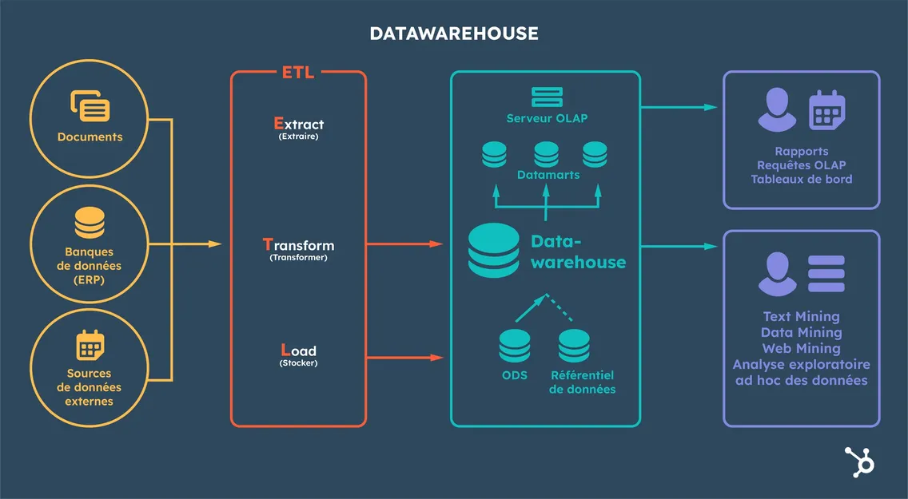

## Data Warehouse

A data warehouse, or enterprise data warehouse (EDW), is a system that aggregates data from different sources into a single, central, consistent data store to support data analysis, data mining, artificial intelligence (AI), and machine learning. A data warehouse system enables an organization to run powerful analytics on huge volumes  of historical data in ways that a standard database cannot.

### What is a data warehouse ? (DWH)

There are two kinds of data used in a company:

#### 1. Operational data keeping: 

- Receive orders
-  React to complaints
-  Fill up stock

=> Manage daily operations in the company

**OLTP** = Online Transactional Processing

#### 2. Analytical decision making (DWH):

- What's the best category ?
- What can be improved?
- How many sales compared to last month?

=> Evaluate performances

=> Decision making

**OLAP** = Online Analytical Processing

A data warehouse is used for reporting and data anylisis and to make fact-based decisions.

It's used and optimied for analytical purposes.

- User friendly
- Fast query performances
- Enabling data analysis from different sources

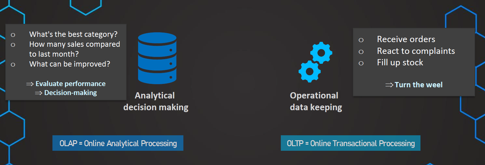

#### Goals of data warehouse

- Centralized and consistent location for data
- Data must be accessible fast (query performance)
- User-friendly (easy to understand)
- Must load data consistently and repeatedly (ETL)
- Reporting and data visualization built on top

### ETL (Extract, Transform, Load)

ETL is a process that extracts, transforms, and loads data from multiple sources to a data warehouse or other unified data repository.

First of all, we **extract** the data from different sources.

Then we **transform** the data from all the ressources and integrate them in the same structure.

Finally we **load** the data into our centralized location.

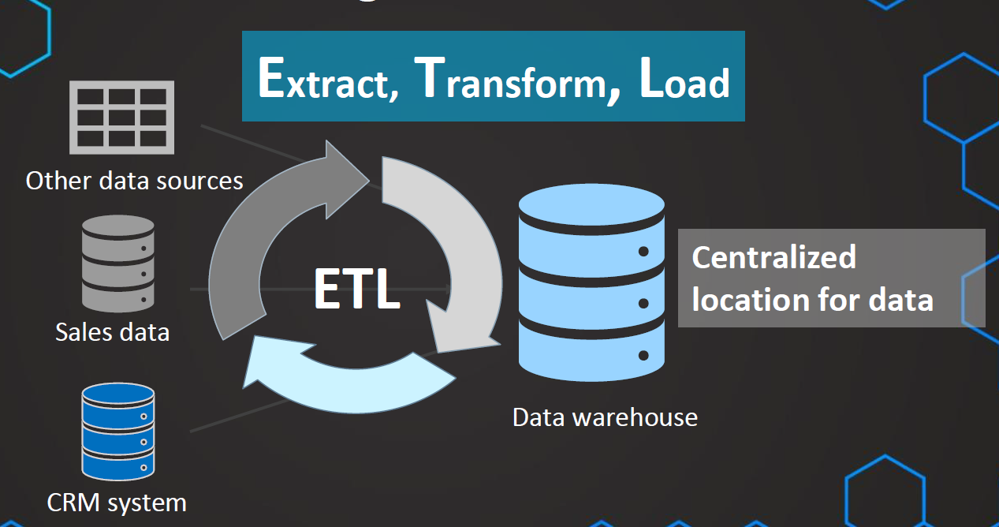

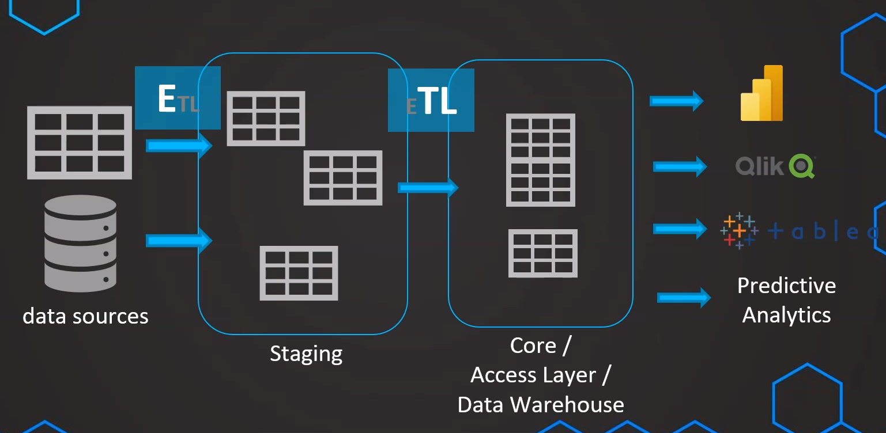

### Business Intelligence (BI)

We create a DWH for Business Intelligence.

BI refers to different strategies, technologies, infrastructures, to create meaningful insights with data analysis.

By data analysis, we hear: 

- Data gathering
- Data storing
- Reporting
- Data visualization
- Data mining
- Predictive analytics

Raw data => Transform => DWH = Meaningful insights / Better decisions

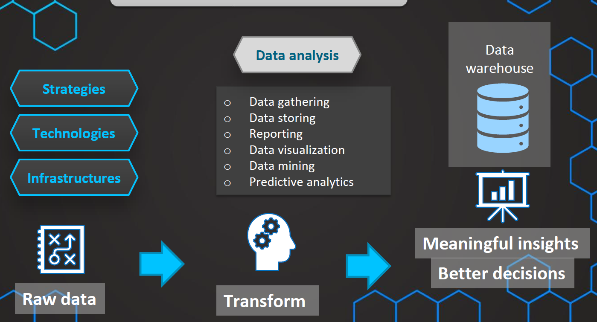

#### Data Lake

Data lake and data warehouse are both used as centralized data storage.

Data lake stores data from different systems, but these are unstructured raw data, using different formats (csv, json, sql, files...) and it's still biga data. The use cases are not or less defined yet.

Data lake is used by data scientists and analysts.

In the data warehouse, data are processed and structured  in a database. The DWH is specific and ready to be used with the main goal in mind. 

Data warehouse is used by business users and IT.

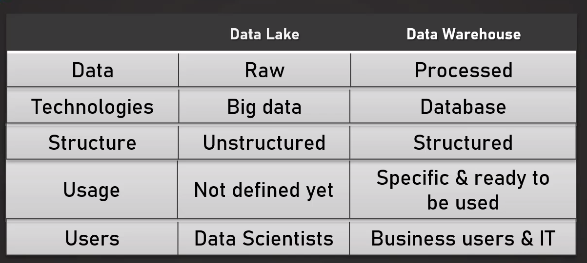

## Data warehouse architecture

### Layers

Data warehouses have several functional layers, each with specific capabilities. The most common data warehouse architecture layers are the source, staging, warehouse, and consumption. 

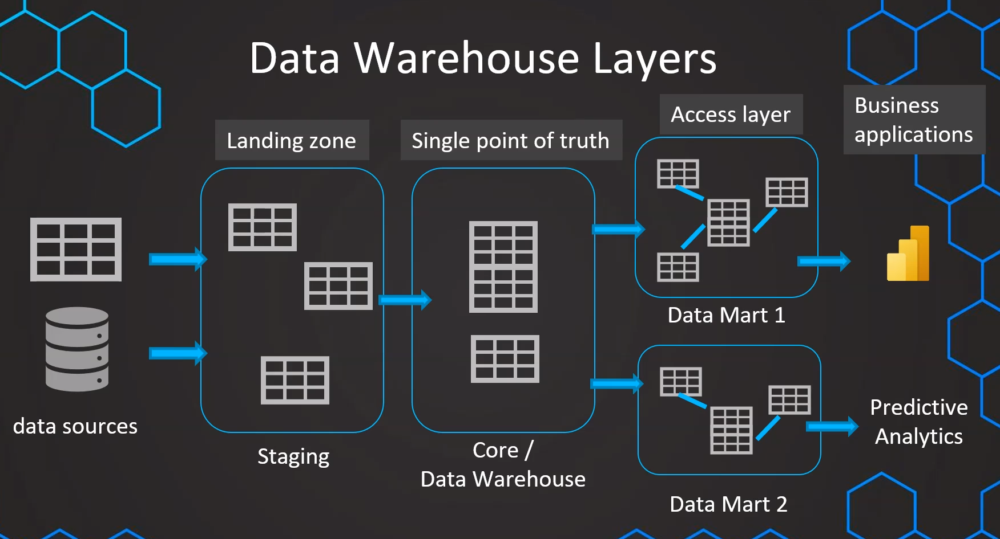

#### **Source layer**

The logical layer of all systems of record (SOR) that feed data into the warehouse. They could include point-of-sale, marketing automation, CRM, or ERP systems. Each source SOR has a specific data format and may require a different data capture method based on that data format.

#### **Staging layer** 

A landing area for data from the source SOR. A data staging best practice is to ingest data from the SOR without applying business logic or transformations. It’s also critical to ensure that staging data is not used in production data analysis; data in the staging area has yet to be cleansed, standardized, modeled, governed, and verified.

Some new / updated data can be added to the DWH. To know what data has been modified or added, we use a delta column, generally the date.

So we can use temporary staging layer (truncated) or persitant one (not truncated).

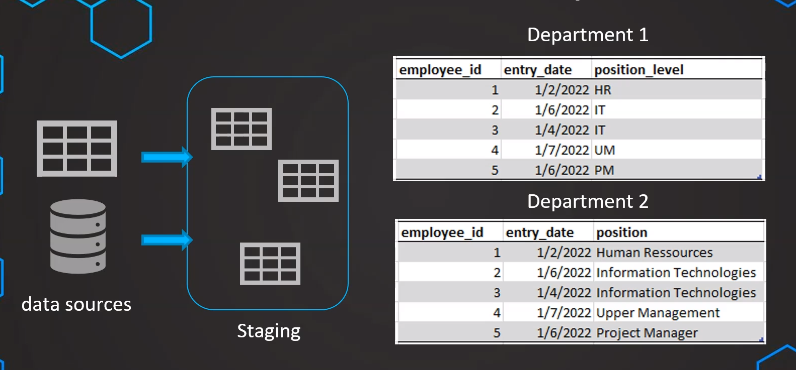

#### **Warehouse layer**

The layer where all of the data is stored. The warehouse data is now subject-oriented, integrated, time-variant, and non-volatile. This layer will have the physical schemas, tables, views, stored procedures, and functions needed to access the warehouse-modeled data. This layer is also known as **the single point of truth**.

In real the DWH is composed of three layers : staging, core and data marts (cfr.infra).

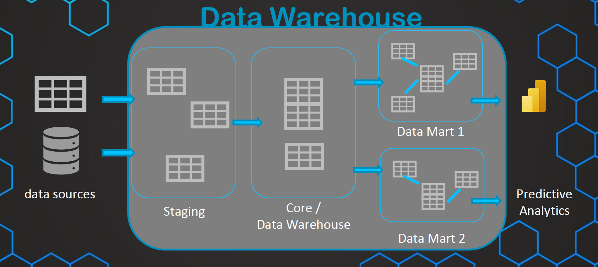

#### Data marts

A Data Mart focuses on a single functional area of an organisation and contains a subset of the data stored in a data warehouse. A Data Mart is a condensed version of a Data Warehouse and is designed to be used by a specific department, unit or set of users within an organisation. For example, marketing, sales, human resources or finance. It is often controlled by a single department within an organisation. They also can be built for a specific use case.

A data mart generally extracts data from just a few sources, compared with a data warehouse. Data marts are small and more flexible and usable than a data warehouse.

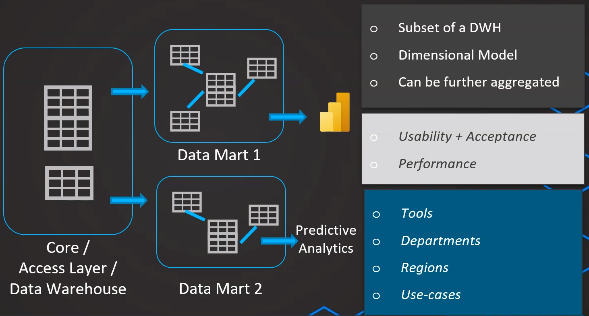

#### **Consumption layer**

Also known as the analytics layer, is where you model data for consumption using analytics tools like ThoughtSpot, data analysts, data scientists, and business users.

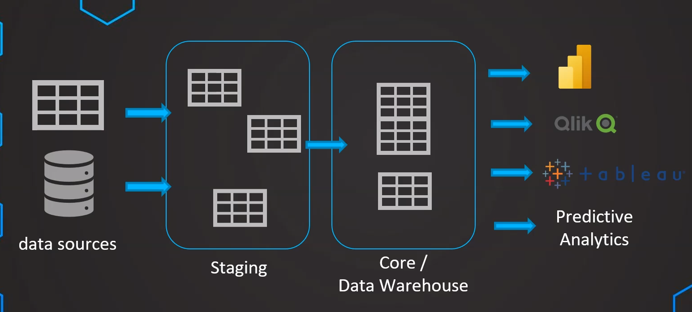

### Relational database

A relational database (RDBSM: Relational Database Management System) organizes data into rows and columns, which collectively form a table. Data is typically structured across multiple tables, which can be joined together via a primary key or a foreign key. These unique identifiers demonstrate the different relationships which exist between tables, and these relationships are usually illustrated through different types of data models. Analysts use SQL (Search Query Language) queries to combine different data points and summarize business performance, allowing organizations to gain insights, optimize workflows, and identify new opportunities. Data are stored in **rows**.

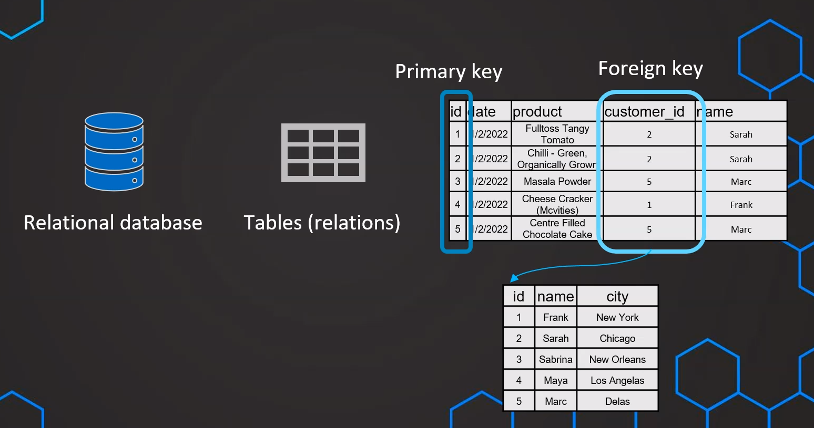

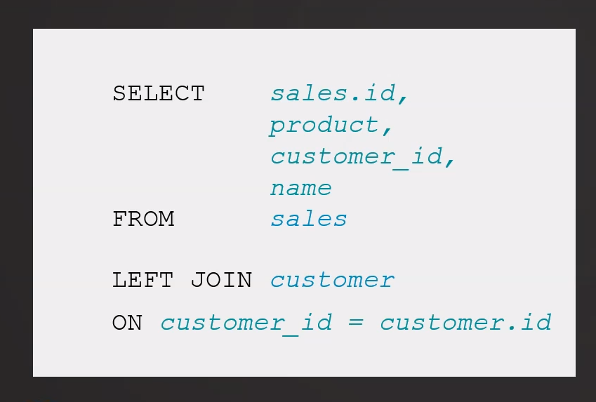

### In-memory databases

An in-memory database is a data storage software that holds all of its data (using a **columnar format** optimized for rapid scans) in the memory of the host. The main difference between a traditional database and an in-memory database relies upon where the data is stored. Even when compared with solid-state drives (SSD), random access memory (RAM) is orders of magnitude faster than disk access. Because an in-memory database uses the memory for storage, access to the data is much faster than with a traditional database using disk operations.

Applications that manage vast quantities of data and require rapid response times can benefit from in-memory database architecture. The data analytics industry increasingly relies on in-memory database systems.

The benefits of an in-memory database include:

- Faster transactions
- No translation
- Multi-user concurrency

In-memory databases are commonly used for:

- Real-time banking, retail, advertising, medical device analytics, machine learning and billing/subscriber applications
- Online interactive gaming
- Geospatial processing
- Processing of streaming sensor data
- Developing embedded software systems
- Applications in transport systems, network switches and routers
- Fulfilling the requirements of e-commerce applications
- Data marts in BI

In-memory databases are more volatile than traditional databases because data is lost when there is a loss of power or the computer’s RAM crashes. Data can be more easily restored from the disks of a traditional database.

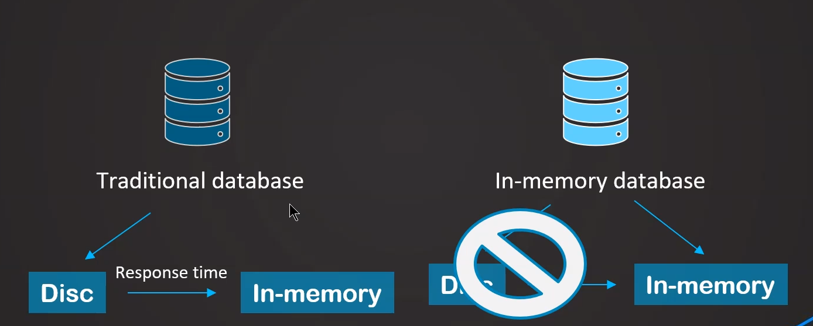

Exemples of in-memory databases:  SAP Hana, MS SQL Server In-Memory Tables, Oracle In-Memory, Amazon MemoryDB.

### OLAP Cubes

Traditional DWH are based on relational DBMS (ROLAP).

With OLAP cubes, data are organized in a non-relational way (MOLAP). Cubes are **multidimensial** dataset.

They use arrays (multidimensial) instead of tables (two dimensions). They are usualy used in data marts or for a specific use-case.

OLAP cubes structure data by aggregating metrics (facts) over dimensions. Dimensions play a crucial role in organizing data, with examples including time, geolocation, and product categories. To model data within OLAP cubes, star or snowflake schemas are commonly used. These schemas provide a blueprint for structuring data hierarchically, ensuring efficient navigation and analysis.

The query language for query OLAP cubes is Multidimensional Expressions (MDX).

OLAP cubes are gradually being replaced by the use of In-memory databases. Or by tabular models (SSAS), ROLAP or columnar storage.

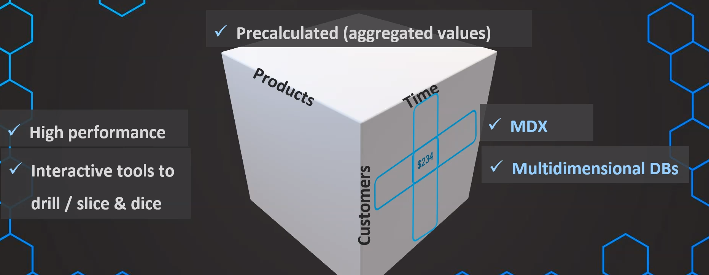

### ODS (Operational data store)

An operational data store (ODS) is a central database that provides a snapshot of the latest data from multiple transactional systems for operational reporting. It enables organizations to combine data in its original format from various sources into a single destination to make it available for business reporting.

ODS vs Data warehouse

Even if they look the same, ODS is used for quick operational decision making. DWH is used for analytical and strategic decision making.

In ODS;

- We don't need a long history
- We need curent or real time data
- ODS is not used for analysis, but to make decisions NOW

Exemple: in a bank, before granting credit, we need to know whether a customer is solvent. So we will use an ODS to check the status of all its accounts, investments, etc...

A company can use both DWH and ODS.

In parralell:

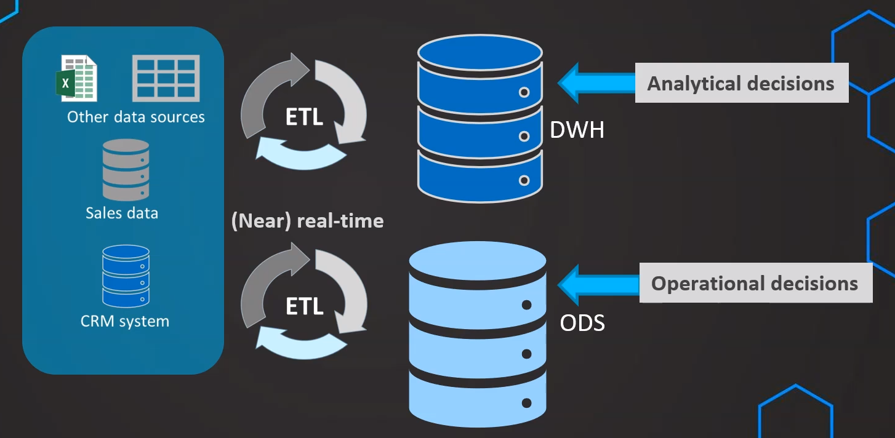

In sequential:

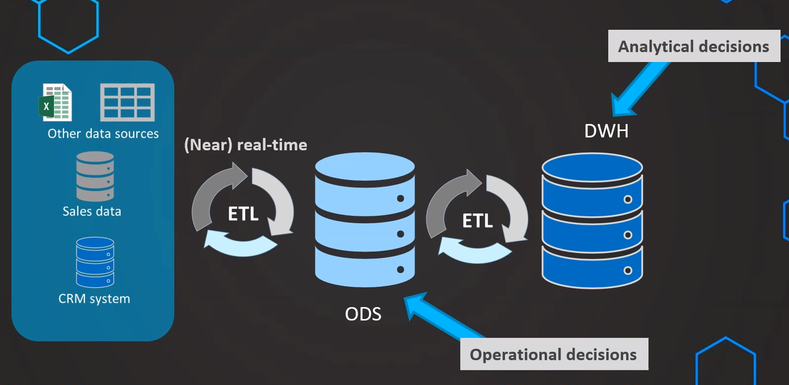

## Dimensional modeling

Dimensional data modeling is an analytical approach used in databases and data warehouses for organizing and categorizing facts into dimension tables. This type of modeling enables fast retrieval of information from large datasets by providing a structure that separates out unrelated or inconsequential data from the main body. The dimensional model also helps identify relationships between different types of data, allowing for deeper analysis of trends and patterns.

It's a method of organizing data in data warehouse, in **facts** and **dimensions**.

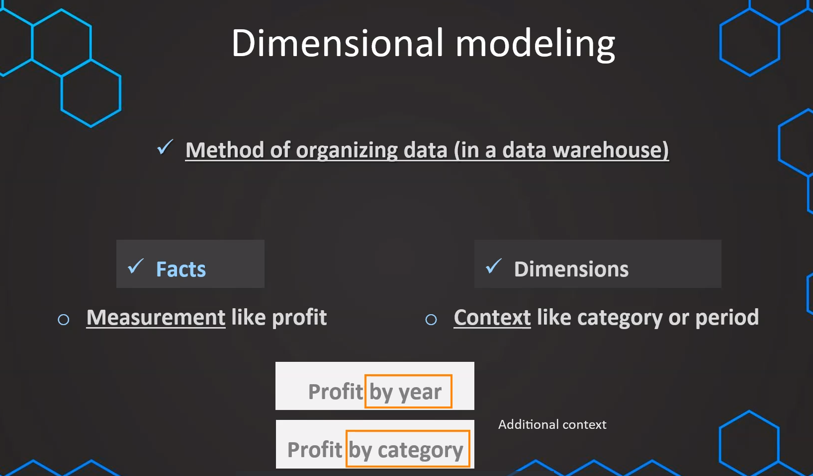

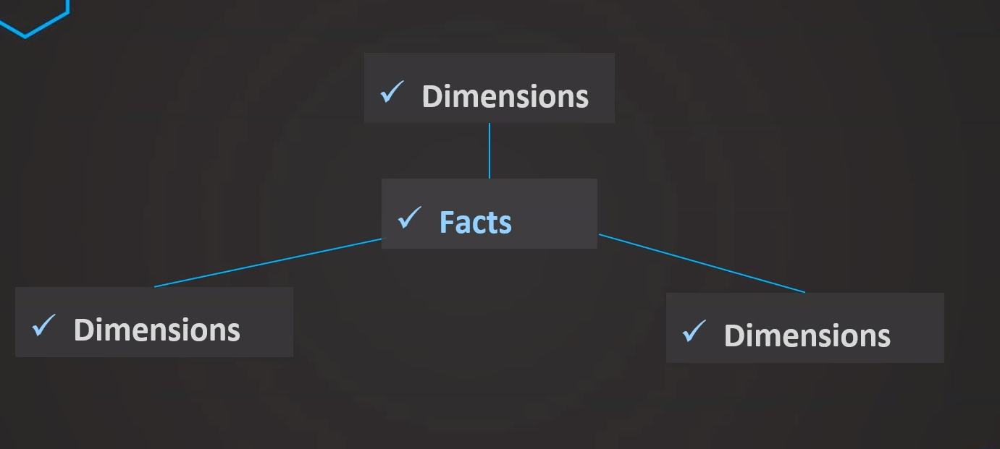

With this model, data can be structured into **logical units**. That improves performances and usability.

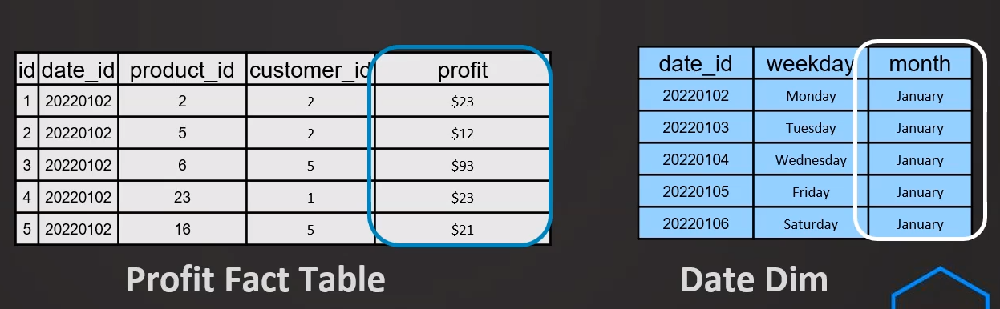

### Facts

In a data warehouse, a fact table is a table that stores the measurements, metrics, or facts related to a business operation.  These are the key measurements.

It is located at the center of a star or snowflake schema and is surrounded by dimension tables.

- When multiple fact tables are used, they can be organized using a "fact constellation schema." 
- A fact table has two types of columns: those that contain the facts and those that serve as foreign keys linking to dimension tables. 
- The primary key of a fact table is often a composite key made up of all of the foreign keys in the table. 
- Fact tables can hold various types of measurements, such as additive, non-additive, and partly additive measures, and store important information in the data warehouse. 
- They are useful for evaluating dimensional attributes because they provide additive values that can act as independent variables.

In most of cases facts are additive, aggregatable (numeric value), measurable and not descriptive.

For instance we can add sales units to find the total sales.

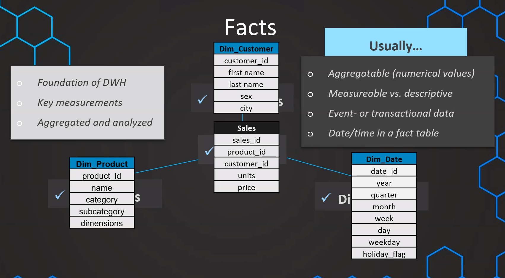

**Granular data** or the **data grain** (level of detail) in a fact table helps define the level of measurement of the data stored. It also determines which dimensions will be included to make up the grain.

Each fact and dimension table has its own grain or granularity. Each table (either fact or dimension) contains some level of detail that is associated with it. The grain of the dimensional model is the finest level of detail that is implied when the fact and dimension tables are joined. For example, the granularity of a dimensional model that consists of the dimensions Date, Store, and Product is product sold in store by day.

The fact table owns the most atomic level of grain. Atomic grain refers to the **lowest level** at which data is captured by a given business process. 

### Dimensions

Dimension provides the context surrounding a business process event. In simple terms, they give who, what, where of a fact. In the Sales business process, for the fact quarterly sales number, dimensions would be

- Who – Customer Names
- Where – Location
- What – Product Name

In other words, a dimension is a window to view information in the facts.

Dimensions are not aggregatable even if the can contain numerical values. They have a descriptive nature.
The values usually don't change, they are static (exemple: name of a product or a customer).

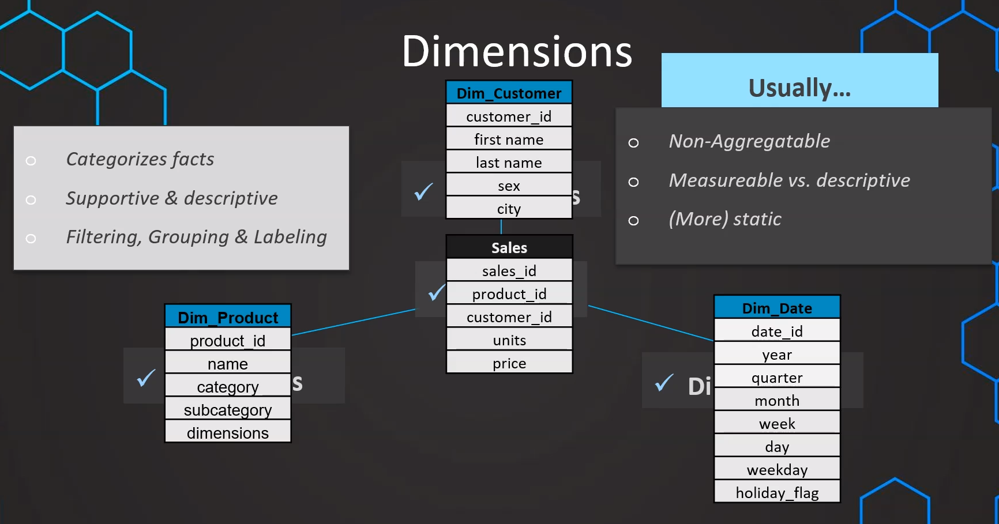

## Useful links

- [What is ETL? (IBM)](https://www.ibm.com/topics/etl)
- [Java](https://www.oracle.com/java/technologies/downloads/#jdk21-windows) (if needed : `SET PENTAHO_JAVA_HOME=C:\Program Files\Java\jdk-21\`)
- [Pentaho Community Edition](https://www.hitachivantara.com/en-us/products/pentaho-plus-platform/data-integration-analytics/pentaho-community-edition.html)
- [PostgreSQL](https://www.postgresql.org/)
- [pgAdmin](https://www.pgadmin.org/download/) (if needed delete : `C:\Users\%USERNAME%\AppData\Roaming\pgAdmin\sessions`)
- [The fundamentals of data warehouse architecture](https://www.thoughtspot.com/data-trends/data-modeling/data-warehouse-architecture)

  
