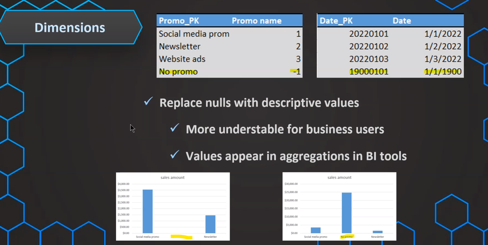
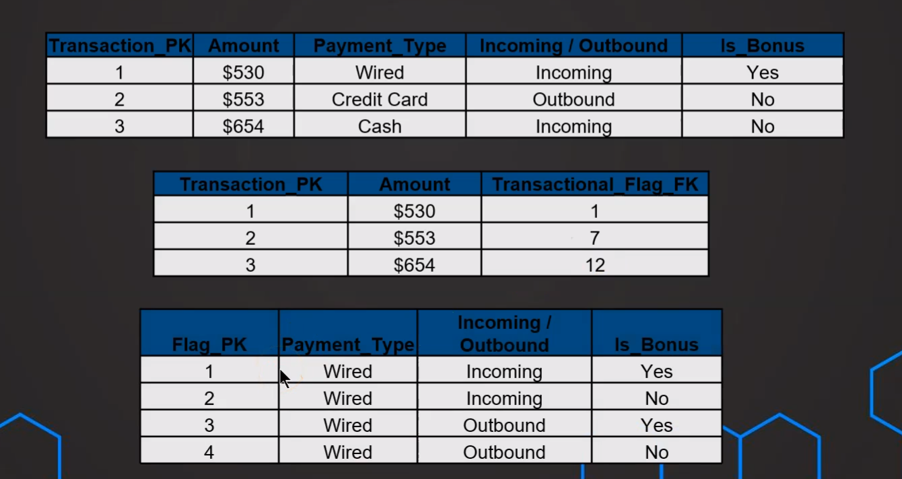
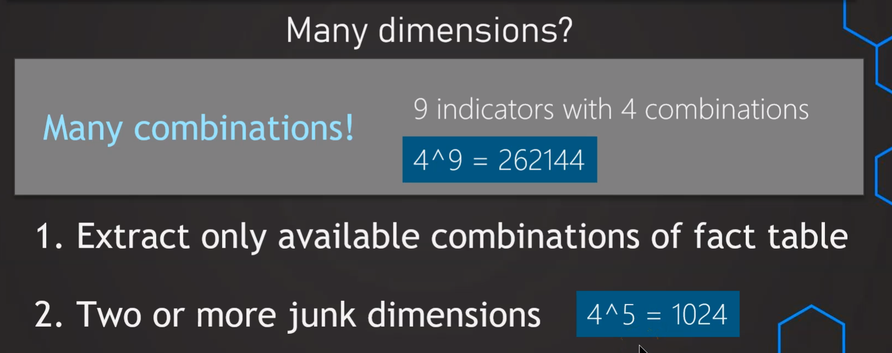

# Data Warehouse 

*February 2024*

> 🔨 Master Data Warehousing, Dimensional Modeling & ETL process. From [Udemy: Data Warehouse - The Ultimate Guide](https://www.udemy.com/course/data-warehouse-the-ultimate-guide), by Nikolai Schuler.

* * *

[TOC]

## Data Warehouse

A data warehouse, or enterprise data warehouse (EDW), is a system that aggregates data from different sources into a single, central, consistent data store to support data analysis, data mining, artificial intelligence (AI), and machine learning. A data warehouse system enables an organization to run powerful analytics on huge volumes  of historical data in ways that a standard database cannot.

### What is a data warehouse ? (DWH)

There are two kinds of data used in a company:

#### 1. Operational data keeping - OLTP

- Receive orders
-  React to complaints
-  Fill up stock

=> Manage daily operations in the company

**OLTP** = Online Transactional Processing

#### 2. Analytical decision making (DWH) - OLAP

- What's the best category ?
- What can be improved?
- How many sales compared to last month?

=> Evaluate performances

=> Decision making

**OLAP** = Online Analytical Processing

A data warehouse is used for reporting and data anylisis and to make fact-based decisions.

It's used and optimied for analytical purposes.

- User friendly
- Fast query performances
- Enabling data analysis from different sources

#### Goals of data warehouse

- Centralized and consistent location for data
- Data must be accessible fast (query performance)
- User-friendly (easy to understand)
- Must load data consistently and repeatedly (ETL)
- Reporting and data visualization built on top

### ETL (Extract, Transform, Load)

ETL is a process that extracts, transforms, and loads data from multiple sources to a data warehouse or other unified data repository.

First of all, we **extract** the data from different sources.

Then we **transform** the data from all the ressources and integrate them in the same structure.

Finally we **load** the data into our centralized location.

### Business Intelligence (BI)

We create a DWH for Business Intelligence.

BI refers to different strategies, technologies, infrastructures, to create meaningful insights with data analysis.

By data analysis, we hear: 

- Data gathering
- Data storing
- Reporting
- Data visualization
- Data mining
- Predictive analytics

Raw data => Transform => DWH = Meaningful insights / Better decisions

#### Data Lake

Data lake and data warehouse are both used as centralized data storage.

Data lake stores data from different systems, but these are unstructured raw data, using different formats (csv, json, sql, files...) and it's still biga data. The use cases are not or less defined yet.

Data lake is used by data scientists and analysts.

In the data warehouse, data are processed and structured  in a database. The DWH is specific and ready to be used with the main goal in mind. 

Data warehouse is used by business users and IT.

## Data warehouse architecture

### Layers

Data warehouses have several functional layers, each with specific capabilities. The most common data warehouse architecture layers are the source, staging, warehouse, and consumption. 

#### Source layer

The logical layer of all systems of record (SOR) that feed data into the warehouse. They could include point-of-sale, marketing automation, CRM, or ERP systems. Each source SOR has a specific data format and may require a different data capture method based on that data format.

#### Staging layer

A landing area for data from the source SOR. A data staging best practice is to ingest data from the SOR without applying business logic or transformations. It’s also critical to ensure that staging data is not used in production data analysis; data in the staging area has yet to be cleansed, standardized, modeled, governed, and verified.

Some new / updated data can be added to the DWH. To know what data has been modified or added, we use a delta column, generally the date.

So we can use temporary staging layer (truncated) or persitant one (not truncated).

#### Warehouse layer

The layer where all of the data is stored. The warehouse data is now subject-oriented, integrated, time-variant, and non-volatile. This layer will have the physical schemas, tables, views, stored procedures, and functions needed to access the warehouse-modeled data. This layer is also known as **the single point of truth**.

In real the DWH is composed of three layers : staging, core and data marts (cfr.infra).

#### Data marts

A Data Mart focuses on a single functional area of an organisation and contains a subset of the data stored in a data warehouse. A Data Mart is a condensed version of a Data Warehouse and is designed to be used by a specific department, unit or set of users within an organisation. For example, marketing, sales, human resources or finance. It is often controlled by a single department within an organisation. They also can be built for a specific use case.

A data mart generally extracts data from just a few sources, compared with a data warehouse. Data marts are small and more flexible and usable than a data warehouse.

#### Consumption layer

Also known as the analytics layer, is where you model data for consumption using analytics tools like ThoughtSpot, data analysts, data scientists, and business users.

### Relational database

A relational database (RDBSM: Relational Database Management System) organizes data into rows and columns, which collectively form a table. Data is typically structured across multiple tables, which can be joined together via a primary key or a foreign key. These unique identifiers demonstrate the different relationships which exist between tables, and these relationships are usually illustrated through different types of data models. Analysts use SQL (Search Query Language) queries to combine different data points and summarize business performance, allowing organizations to gain insights, optimize workflows, and identify new opportunities. Data are stored in **rows**.

### In-memory databases

An in-memory database is a data storage software that holds all of its data (using a **columnar format** optimized for rapid scans) in the memory of the host. The main difference between a traditional database and an in-memory database relies upon where the data is stored. Even when compared with solid-state drives (SSD), random access memory (RAM) is orders of magnitude faster than disk access. Because an in-memory database uses the memory for storage, access to the data is much faster than with a traditional database using disk operations.

Applications that manage vast quantities of data and require rapid response times can benefit from in-memory database architecture. The data analytics industry increasingly relies on in-memory database systems.

The benefits of an in-memory database include:

- Faster transactions
- No translation
- Multi-user concurrency

In-memory databases are commonly used for:

- Real-time banking, retail, advertising, medical device analytics, machine learning and billing/subscriber applications
- Online interactive gaming
- Geospatial processing
- Processing of streaming sensor data
- Developing embedded software systems
- Applications in transport systems, network switches and routers
- Fulfilling the requirements of e-commerce applications
- Data marts in BI

In-memory databases are more volatile than traditional databases because data is lost when there is a loss of power or the computer’s RAM crashes. Data can be more easily restored from the disks of a traditional database.

Exemples of in-memory databases:  SAP Hana, MS SQL Server In-Memory Tables, Oracle In-Memory, Amazon MemoryDB.

### OLAP Cubes

Traditional DWH are based on relational DBMS (ROLAP).

With OLAP cubes, data are organized in a non-relational way (MOLAP). Cubes are **multidimensial** dataset.

They use arrays (multidimensial) instead of tables (two dimensions). They are usualy used in data marts or for a specific use-case.

OLAP cubes structure data by aggregating metrics (facts) over dimensions. Dimensions play a crucial role in organizing data, with examples including time, geolocation, and product categories. To model data within OLAP cubes, star or snowflake schemas are commonly used. These schemas provide a blueprint for structuring data hierarchically, ensuring efficient navigation and analysis.

The query language for query OLAP cubes is Multidimensional Expressions (MDX).

OLAP cubes are gradually being replaced by the use of In-memory databases. Or by tabular models (SSAS), ROLAP or columnar storage.

### ODS (Operational data store)

An operational data store (ODS) is a central database that provides a snapshot of the latest data from multiple transactional systems for operational reporting. It enables organizations to combine data in its original format from various sources into a single destination to make it available for business reporting.

ODS vs Data warehouse

Even if they look the same, ODS is used for quick operational decision making. DWH is used for analytical and strategic decision making.

In ODS;

- We don't need a long history
- We need curent or real time data
- ODS is not used for analysis, but to make decisions NOW

Exemple: in a bank, before granting credit, we need to know whether a customer is solvent. So we will use an ODS to check the status of all its accounts, investments, etc...

A company can use both DWH and ODS.

In parralell:

In sequential:

## Dimensional modeling

Dimensional data modeling is an analytical approach used in databases and data warehouses for organizing and categorizing facts into dimension tables. This type of modeling enables fast retrieval of information from large datasets by providing a structure that separates out unrelated or inconsequential data from the main body. The dimensional model also helps identify relationships between different types of data, allowing for deeper analysis of trends and patterns.

It's a method of organizing data in data warehouse, in **facts** and **dimensions**.

With this model, data can be structured into **logical units**. That improves performances and usability.

### Facts

In a data warehouse, a fact table is a table that stores the measurements, metrics, or facts related to a business operation.  These are the key measurements.

It is located at the center of a star or snowflake schema and is surrounded by dimension tables.

- When multiple fact tables are used, they can be organized using a "fact constellation schema." 
- A fact table has two types of columns: those that contain the facts and those that serve as foreign keys linking to dimension tables. 
- The primary key of a fact table is often a composite key made up of all of the foreign keys in the table. 
- Fact tables can hold various types of measurements, such as additive, non-additive, and partly additive measures, and store important information in the data warehouse. 
- They are useful for evaluating dimensional attributes because they provide additive values that can act as independent variables.

In most of cases facts are additive, aggregatable (numeric value), measurable and not descriptive.

For instance we can add sales units to find the total sales.

**Granular data** or the **data grain** (level of detail) in a fact table helps define the level of measurement of the data stored. It also determines which dimensions will be included to make up the grain.

Each fact and dimension table has its own grain or granularity. Each table (either fact or dimension) contains some level of detail that is associated with it. The grain of the dimensional model is the finest level of detail that is implied when the fact and dimension tables are joined. For example, the granularity of a dimensional model that consists of the dimensions Date, Store, and Product is product sold in store by day.

The fact table owns the most atomic level of grain. Atomic grain refers to the **lowest level** at which data is captured by a given business process. 

### Dimensions

Dimension provides the context surrounding a business process event. In simple terms, they give who, what, where of a fact. In the Sales business process, for the fact quarterly sales number, dimensions would be

- Who – Customer Names
- Where – Location
- What – Product Name

In other words, a dimension is a window to view information in the facts.

Dimensions are not aggregatable even if the can contain numerical values. They have a descriptive nature.
The values usually don't change, they are static (exemple: name of a product or a customer).

### Star schema

A star schema is a type of data modeling technique used in data warehousing to represent data in a structured and intuitive way. In a star schema, data is organized into a central fact table that contains the measures of interest, surrounded by dimension tables that describe the attributes of the measures.

The fact table in a star schema contains the measures or metrics that are of interest to the user or organization. For example, in a sales data warehouse, the fact table might contain sales revenue, units sold, and profit margins. Each record in the fact table represents a specific event or transaction, such as a sale or order.

The dimension tables in a star schema contain the descriptive attributes of the measures in the fact table. These attributes are used to slice and dice the data in the fact table, allowing users to analyze the data from different perspectives. For example, in a sales data warehouse, the dimension tables might include product, customer, time, and location.

Here in the abovecapture, in product table we have **data redundancy**.

To reduce that reduduncy (using a **normalization** process) we will have to use a snowflake schema.

### Snowflake schema

The snowflake schema consists of one fact table that is connected to many dimension tables, which can be connected to other dimension tables through a many-to-one relationship.

Tables in a snowflake schema are usually normalized to the third normal form. Each dimension table represents exactly one level in a hierarchy.

### Constellation schema

The fact constellation schema is also known as the galaxy schema. It consists of multiple fact tables that share common dimensions but not other facts. This model is useful when there are different types of transactions or events being captured in the same warehouse, for example sales data vs customer service requests.

## Facts

### Additivity in facts

The measures in a fact table can be one of the following types:

**Additive**

Additive measures are measures that **can be aggregated across all of the dimensions** in the fact table, and are the most common type of measure. Additive measures are used across several dimensions for summation purposes.
Since dimensional modeling involves hierarchies in dimensions, aggregation of information over different members in the hierarchy is a key element in the usefulness of the model. Since aggregation is an additive process, use additive measures as much as possible.

**Semi-additive**

Semi-additive measures **can be aggregated across some dimensions**, but not all dimensions. For example, measures such as head counts and inventory are considered semi-additive.

**Non-additive**

Non-additive measures are measures that **cannot be aggregated across any of the dimensions**. These measures cannot be logically aggregated between records or fact rows. Non-additive measures are usually the result of ratios or other mathematical calculations. The only calculation that can be made for such a measure is to get a count of the number of rows of such measures.

### Nulls in facts

SQL and BI tools can deal easily with nulls.

It can be usefull sometimes to change null values by zero.

For instance in the exemple below, to clulate the daily average.

If we have null in foreign keys, we have to create somme dummy values instead of these nell otherwise some data will be missing.

### Year-to-Date facts

Business users often request year-to-date (YTD) values in a fact table. It is hard to argue against a single request, but YTD requests can easily morph into “YTD at the close of the fiscal period” or “fiscal period to date.” A more reliable, extensible way to handle these assorted requests is to **calculate the YTD metrics in the BI applications** or OLAP cube rather than storing YTD facts in the fact table.

Because if we aggraegate these dates accross several dimensions, with different grain, our calculations will be wrong.

### Types of fact tables

There are three types of fact tables : transactionan, periodic snapshot, accumulating snapshot.

#### Transactional fact table

A transactional fact table is a fact table where:

- Each event is stored in the fact table only once.
- It has a date column indicating when the event occurred.
- It has an identifier column which identifies each event.
- The number of rows is the same as the source table.

#### Periodic snapshot fact table

A periodic snapshot fact captures the aggregate or balance of a business process or event for a given period. Common examples are monthly financial account balances, monthly bank account balances etc. Periodic Snapshot fact tables are usually built from the data contained in a transaction fact table.

#### Accumulating snapshot fact table

Accumulating snapshot facts are updatable fact records used to measure time between two or more related events. The most common example of this type of fact can be seen in order processing. 

#### Differences between three types

#### Factless fact table

A factless fact table is a table that contains only foreign keys to dimensions, but no numeric facts. It is used to capture events or situations that have no measurable outcome, but are important for analysis.

#### Steps to create a fact table

There are 4 keys decisions to design a fact table.

- Identify business process for analysis: sales, order processing...
- Declare the grain: transaction, order, order lines, daily, daily+location...
- Identify dimensions that are relevant: what, when, where, how and why...
- Identify facts for measurement and when we can aggregate them if necessary.

#### Natural vs. Surrogate key

A natural key is a key that is derived from the data itself, such as a customer ID, a product code, or a date. A surrogate key is a key that is generated artificially, such as a sequential number, a GUID, or a hash.

Why using surrogate keys ?

### Case study: E-Commerce

#### The project

#### Identify the business process

#### Define the grain

#### Identify the dimensions

#### Identify the facts

#### Result

## Dimensions

### Dimensions tables

Each dimensional table needs to include a primary key that corresponds to a foreign key in the fact table.  This PK should be a surrogate key (SK). A surrogate key uniquely identifies each entity in the dimension table, regardless of its natural source key. This is primarily because a surrogate key generates a simple integer value for every new entity.

If necessary, we can keep the natural key using a join table.

We will use many columns with descriptive attributes to improve research.

Dimension tables are useful to group and filter (slice and dice) the data. Because these tables are the entry point for data analysis.

### Date dimensions

It's one of the most important and used dimension.

Because performances are usually measured over time and across the different date dimensional aspects. Date dimensions give us a built-in calendar which helps minimize complex date operations. 

The surrogate key should use that format: **YYYYMMDD**

In this date dimension, we have to add a dummy value in case if there is no date value in our fact table (no date or null => FK with a dummy value).

If the timestamp is a part of the source system and is important for our analysis, it usually owns its dimension table too.

### Nulls in dimensions

Null must be avoided at all costs in foreign keys in dimensions  that are used to create joins or relationship between dimension tables, by replacing them with a dummy value (ex: -1 ).

Nulls in FK breaks referential integrity and don't appear in Joins.

Of course the dummy value has to have the same data type than other datas in the column!

Nulls can be present in facts (ex: no sales during public hollidays => null otherwise if we use zero, it will screw the average). They works very well with the agreggations (sum, average...).

For other values in dimensions tables, null should be replaced with descriptive values.

Because business user have to undertsand what does null refer to and decide if these values will appear in their reporting or not.

### Hierarchies in dimensions

The data model used to store data in the denormalized form is called Dimensional Modeling. It is the technique of storing data in a Data Warehouse in such a way that enables fast query performance and easy access to its business users.

If sources data are often normalized (to avoid redundancy), in the data warehouse data should be de-normalized/flatten to improve usability and performances.

### Types of dimension tables ###

#### Conformed dimensions

A conformed dimension is a dimension that is shared by multiple fact tables / stars.

They are used to compare facts accros different fact tables.

We need to have the identical attributes or a subset of attributes used for both of these facts.

It is not necessary to have the same granularity.

For instance below, in *cost fact*, we have one row = 1 day, but in *sales fact*, we have duplicated value, so several rows for a day. So there can be a different granularity.

We also can use different FK in the two fact tables linking to the same dimension.

#### Degenerate dimensions

The degenerate dimension is a dimension key in the fact table which is generally **without attributes**. For example, purchase order number, service interruption number, etc. In the case of the service interruption number, users want to know, for example, "how many times a customer has been interrupted in a specific period of time".
As this is a single dimension key, we avoid creating a dimension table, which means **that this dimension table has degenerated into the fact table**, which is why this key is called "degenerated dimension".

#### Junk dimensions (Transactional indicator/flag dimension) ####

The "Junk dimension" is a dimension that contains all kinds of flags, statuses and codes with mow cardinality that are not part of any regular dimension. In the field of energy distribution, a service interruption can be of the "Low Voltage" or "Medium Voltage" type. This type of code is therefore stored in a special table called "Junk dimension" or "transactional indicator/flagdimension".

It's like a box in were we store items we need but that don't fit anywhaere else.

We can also make several junk dimensions.

But take care about de many combinations (combinations^indicators).

#### Role-playing dimensions

A table with multiple relationships between itself and another table is known as a role-playing dimension. For example, the Sales fact in the following example has multiple relationships to Time on the keys Order Day , Ship Day , and Close Day .

#### Causal dimensions  ####

This is a dimension that provokes action. A good example of this kind of dimension is the "Promotion" dimension, which can generally cause sales. Another example, in the field of energy distribution, is the "Weather conditions" dimension, which can cause "service interruptions". The "Weather" dimension is therefore a causal dimension.

#### Slowly changing dimensions ####

Slowly changing dimensions refer to how data in your data warehouse changes over time. Slowly changing dimensions have the same natural key but other data columns that may or may not change over time depending on the type of dimensions that it is (ex: customer adress). 

Slowly changing dimensions are important in data analytics to track how a record is changing over time. The way the database is designed directly reflects whether historical attributes can be tracked or not, determining different metrics available for the business to use. 

We manage the situation by choosing between differents solutions:

- Overwrite the old value
- Versioning
- Original value / current value

#### Rapid changing dimensions ####

A dimension attribute change is a rapidly changing feature. If we do not need to track changes, rapid quality is not a problem. If you need to follow the changes, then using the standard slowly changing amplitude technique can cause massive amplitude size inflation. The solution moves the attribute to its dimension, with a different foreign key. The new dimension is called a rapidly changing size.

### Case stydy: Date dimension ###

SQL code to create and populate DimDate: [Main ressources/DateDimension/](Main ressources/DateDimension/)

### Slowly changing dimensions ###

A slowly changing dimension (SCD) in data management and data warehousing is a dimension which contains relatively static data which can change slowly but unpredictably, rather than according to a regular schedule.

That's why we need a type of strategy to handle changes in dimensions.

1. Be proactive: Ask about potential changes
2. Ask business user but also IT responsibles for these source data systems
3. Each changing attribute needs its own strategy

#### Type 0: Retain Original ####

The Type 0 dimension attributes never change and are assigned to attributes that have durable values or are described as 'Original'. Examples: Date of Birth, Original Credit Score. Type 0 applies to most date dimension attributes (with the exception of company holidays, for example).

#### Type 1: Overwrite ####

This method overwrites old with new data, and therefore does not track historical data.
Only current state is reflected.  No fact table needs to be modified. But the history is lost. Exemple: change the name of a product category

Warning: in some cases it might affect existing queries.

#### Type 2: New row ####

This method tracks historical data by creating multiple records for a given natural key in the dimensional tables with separate surrogate keys and/or different version numbers. Unlimited history is preserved for each insert.

No updates are made in the fact table.

##### Administrate Type 2 SCD #####

We had to add the rew in the dimension first.

Then lookup in the dimension with natural key + a comparison between effective and expiration date.

We also can add a colum for instance "Is_Current"

##### Mixing Type 1 + 2 #####

For some attributes it's not necessary to keep all the history (ex: product name), but it's not the same for major changes (ex: category).

But the final decision remains to business user.

#### Type 3: Additional Attributes ####

This method tracks changes using separate columns and preserves limited history. The Type 3 preserves limited history as it is limited to the number of columns designated for storing historical data. The original table structure in Type 1 and Type 2 is the same but Type 3 adds **additional columns**.

## ETL ##

## Useful links

- [The fundamentals of data warehouse architecture](https://www.thoughtspot.com/data-trends/data-modeling/data-warehouse-architecture)
- [What is ETL? (IBM)](https://www.ibm.com/topics/etl)
- [Java](https://www.oracle.com/java/technologies/downloads/#jdk21-windows) 
- [Pentaho Community Edition](https://www.hitachivantara.com/en-us/products/pentaho-plus-platform/data-integration-analytics/pentaho-community-edition.html) (if needed : `SET PENTAHO_JAVA_HOME=C:\Program Files\Java\jdk-21\`)
- [PostgreSQL](https://www.postgresql.org/)
- [pgAdmin](https://www.pgadmin.org/download/) (if needed delete : `C:\Users\%USERNAME%\AppData\Roaming\pgAdmin\sessions`)

  
